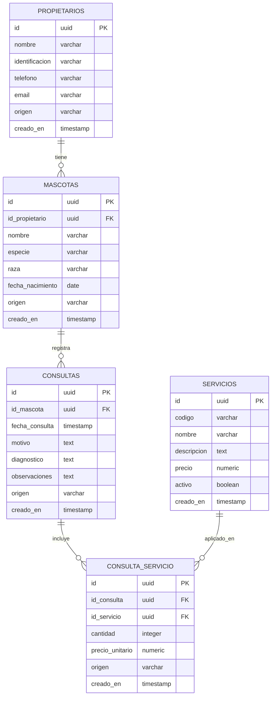

# Practica de base de datos distribuidas - Replicacion Bidireccional

## Enunciado del problema

Una cadena de clínicas veterinarias tiene dos sucursales: una en Quito y otra en Cuenca.
Cada sucursal registra sus propias citas, mascotas, propietarios y servicios realizados.

Sin embargo, la administración necesita que:

- Los datos de mascotas y propietarios estén sincronizados.

- Los clientes deben poder llevar a su mascota a cualquiera de las dos sedes sin necesidad de volver a registrarla.

- Los catálogos de servicios (vacunas, consultas, baños, cirugías, precios) sean idénticos.

- Ambas sucursales deben ofrecer la misma información, precios y tipos de servicios.

- Las citas y servicios aplicados se repliquen.

- Para poder consultar historiales clínicos desde cualquier sucursal.

# Para levantar las 2 bases de datos con docker usar el comando

```bash
docker compose up -d
```

